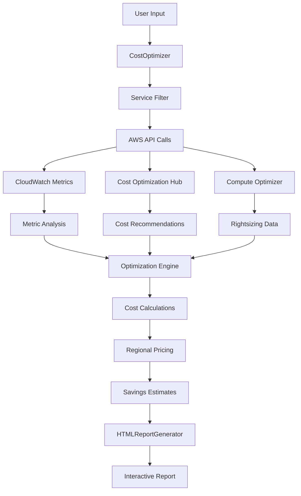

# Architecture Documentation

This document provides comprehensive architectural diagrams and technical details for the AWS Cost Optimization Scanner.

## System Architecture Overview


The AWS Cost Optimization Scanner follows a modular architecture with clear separation of concerns:

### Core Components

1. **User Interface Layer**
   - **CLI Interface**: Command-line interface for running scans
   - **HTML Reports**: Interactive web-based reports with professional styling

2. **Application Layer**
   - **CostOptimizer (8,677 lines)**: Main optimization engine
   - **HTMLReportGenerator (3,699 lines)**: Professional report generation

3. **AWS Services Integration**
   - **30 AWS Services**: Comprehensive coverage across all major service categories
   - **Cost Optimization Services**: Integration with AWS Cost Hub and Compute Optimizer

## Service Integration Flow


The scanner integrates with 30 AWS services organized into logical categories:

### Service Categories

#### Compute Services (4 Services)
- **EC2**: Instance optimization, rightsizing, previous generation migration
- **Lambda**: Memory optimization, ARM migration, usage analysis
- **Auto Scaling**: Static ASG detection, scheduling optimization
- **Batch**: Spot allocation strategy, Graviton recommendations

#### Storage Services (6 Services)
- **S3**: Storage classes, lifecycle policies, Intelligent-Tiering
- **EBS**: Volume optimization, gp2→gp3 migration, unattached volumes
- **EFS**: Lifecycle policies, One Zone migration, idle detection
- **FSx**: Capacity optimization, storage type recommendations

#### Database Services (5 Services)
- **RDS**: Multi-AZ optimization, backup retention, storage optimization
- **DynamoDB**: Capacity mode analysis, reserved capacity opportunities
- **ElastiCache**: Graviton migration, reserved nodes, version updates
- **Redshift**: Reserved instances, rightsizing, serverless analysis

#### Network Services (4 Services)
- **VPC/EIP**: Unused Elastic IPs, NAT Gateway optimization
- **Load Balancers**: Consolidation opportunities, unused resources
- **CloudFront**: Price class optimization, caching analysis
- **Route53**: Hosted zone optimization, health check analysis

## Data Flow Architecture



## Component Details

### CostOptimizer Engine

The main optimization engine implements:

- **54 AWS Service Clients**: Comprehensive API coverage with retry logic
- **220+ Optimization Checks**: Automated analysis across all services
- **Regional Pricing Engine**: Accurate cost calculations with multipliers
- **Service Filtering System**: Granular control over scan scope
- **Error Handling**: Graceful degradation and comprehensive logging

### Service Filtering Architecture

```python
service_map = {
    'ec2': ['ec2', 'ami'],
    'ebs': ['ebs'],
    's3': ['s3'],
    'containers': ['containers', 'ecs', 'eks', 'ecr'],
    'network': ['network', 'elastic_ip', 'nat_gateway', 'load_balancer'],
    # ... 30 total service categories
}
```

Benefits:
- **50-80% faster scans** when targeting specific services
- **Focused analysis** reduces noise and improves actionability
- **Team-specific workflows** for different responsibilities

### Cost Calculation Pipeline

1. **Resource Discovery**: Paginated API calls to discover all resources
2. **Utilization Analysis**: CloudWatch metrics for accurate assessment
3. **Optimization Logic**: Service-specific optimization algorithms
4. **Cost Estimation**: Regional pricing with conservative estimates
5. **Confidence Scoring**: High/Medium/Low confidence levels
6. **Report Generation**: Professional HTML with interactive features

## Performance Architecture

### Enterprise Scale Support

- **Pagination**: All AWS API calls use pagination for unlimited resources
- **Retry Logic**: Exponential backoff with up to 10 attempts
- **Memory Efficiency**: Streaming processing for large datasets
- **Parallel Processing**: Independent service analysis where possible

### Performance Characteristics

- **Full Scan**: 5-15 minutes for typical enterprise accounts
- **Filtered Scan**: 1-5 minutes when targeting specific services
- **Fast Mode**: 50-80% faster for S3-heavy environments
- **Memory Usage**: <500MB for most scans

## Security Architecture

### Read-Only Access Model

- **No Write Operations**: Tool only reads AWS resources
- **Minimal Permissions**: 103 read-only permissions documented
- **Secure Credentials**: Standard AWS credential chain
- **Local Processing**: No external data transmission

### Error Handling Strategy

- **Permission Issues**: Continue scan with warnings
- **API Throttling**: Exponential backoff with intelligent retry
- **Service Unavailability**: Skip with proper logging
- **Partial Failures**: Generate reports with available data

## Integration Architecture

### AWS Native Services

- **Cost Optimization Hub**: Consolidates recommendations across accounts
- **Compute Optimizer**: Machine learning-based rightsizing
- **CloudWatch**: Real metrics for accurate utilization analysis
- **Cost Explorer**: Historical cost and usage data

### External Integrations

- **CI/CD Pipelines**: Automated cost optimization in deployment workflows
- **Monitoring Systems**: Integration with enterprise monitoring tools
- **Reporting Systems**: CSV/JSON export for business intelligence
- **Alerting Systems**: Cost optimization alerts and notifications

## Extensibility Architecture

### Adding New Services

1. **Service Client**: Initialize AWS service client with retry config
2. **Analysis Method**: Implement service-specific optimization logic
3. **Cost Calculations**: Add regional pricing and savings estimates
4. **Report Integration**: Update HTML generator for new service
5. **Documentation**: Update API docs and service reference

### Plugin Architecture (Future)

- **Custom Checks**: User-defined optimization rules
- **Custom Reports**: Configurable report templates
- **Custom Thresholds**: Organization-specific optimization criteria
- **Custom Integrations**: Third-party tool integrations

This architecture enables the scanner to handle enterprise-scale AWS environments while providing accurate, actionable cost optimization recommendations across all major AWS services.
